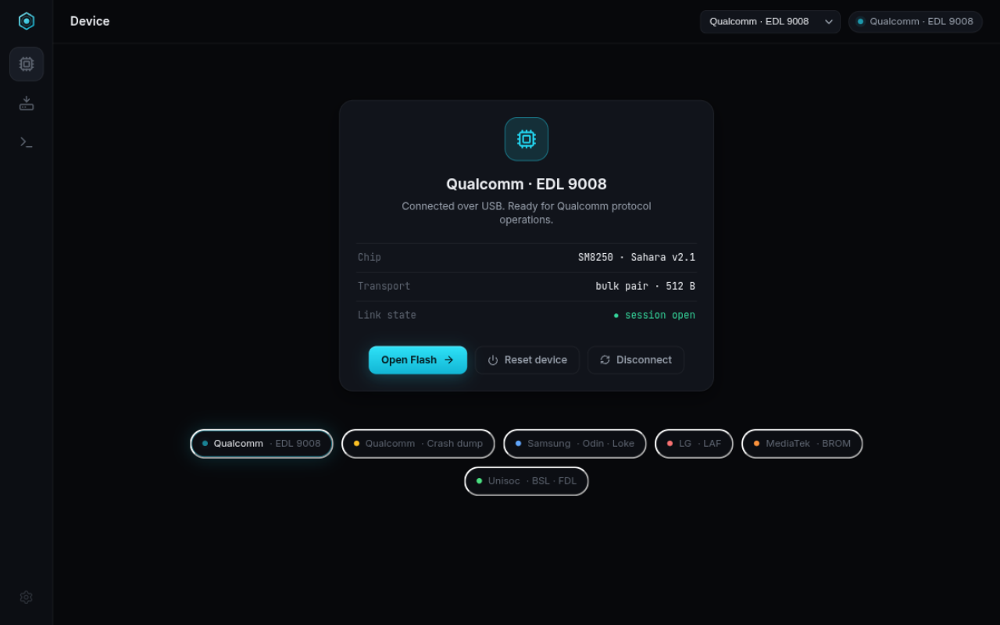

# Ultron — TS UI experiment (`ts-ui` branch)

A design experiment: the same Ultron flashing tool, reimagined with a
TypeScript frontend rendered in a **native desktop window** (Tauri 2 +
webkit2gtk on Linux) — not a website in a browser. The Zig flashing core on
`main` is untouched; nothing here is wired to hardware yet.



> **Design history:** the first skin, "Precision Dark" (custom near-black
> surfaces, springs everywhere, glow accents), is preserved on branch
> `ts-ui-precision-dark` and ships in the `UltronTool-BETA-0.1.0` artifact.
> The current skin is **Material 3** (below).

## Why this exists

GTK4/libadwaita is correct for the shipped app (native, fast, dependency-free
runtime) but its animation and layout vocabulary is limited. This branch
explores what the product could feel like with a web-grade rendering stack:
springs everywhere, shared-element transitions, hold-to-confirm destructives.
If the experiment lands, the frontend stays; the backend becomes a thin IPC
bridge to the existing Zig `manager.zig` (phase 2).

## Art direction — Material 3

Authentic M3, not M3-flavored: the color roles are **generated** from seed
`#22d3ee` with Google's `@material/material-color-utilities` (HCT tonal
palettes) and checked in as static CSS — dark scheme by default, light scheme
flips on `prefers-color-scheme`. Components follow the spec:

- **Shape** — pill buttons (full radius), 12dp cards, 28dp dialogs, 4dp chips.
- **State layers** — interaction is answered with the spec's 8% hover / 12%
  press current-color overlays instead of scale-and-glow. Calm by design.
- **Type** — Roboto on the M3 type scale (24dp regular headlines, 14/500
  labels); JetBrains Mono survives only for data (console, hex, sizes).
- **Motion** — M3 easing curves, no springs: fade-through page transitions
  (90ms out, 210ms in + 92→100 scale), morphing rail indicator, snackbar
  slide. Everything answers in ≤350ms.
- **Components** — M3 navigation rail (icon-in-pill + labels), filled/tonal/
  outlined/text/error buttons, M3 switches, linear progress with stop-dot,
  snackbars on inverse-surface, segmented buttons, filter chips with
  checkmarks.

Kept from the first skin because the logic is sound (owner-approved):
hold-to-confirm destructives, byte-accurate job telemetry, slot staging that
mirrors each vendor module's real inputs, and protocol/app log separation.

## UX logic worth stealing for mainline

- **Hold-to-confirm** for destructive ops: enabling "Erase user data" replaces
  Start with a red button whose fill sweeps while held (~900ms). Release early
  and it drains back. Commitment is visualized instead of nagging with dialogs.
- **Slot staging** mirrors what each vendor module actually consumes (programmer
  + rawprogram/patch for Qualcomm; BL/AP/CP/CSC/PIT for Samsung; FDL1/FDL2 for
  Unisoc, with the unlanded PAC parser shown locked "SOON" instead of hidden).
- **Job telemetry** is byte-accurate: percent, bytes, throughput, ETA and the
  current protocol step in one strip, with cancel always one click away.
- **Console** separates protocol chatter (violet mono) from app events, with
  level filters, autoscroll and save.

## Status: real (Qualcomm EDL vertical slice)

Since 0.3.0 the app talks to the **actual Zig flashing core**: a headless
`ultron-daemon` (src/ipc/, spawned by the Tauri shell, line-JSON over stdio —
see `src/ipc/codec.zig` for the wire contract) owns the udev device scanner
and the persistent Firehose session manager. The UI shows real hotplug
detection, connects, uploads the programmer over Sahara, flashes rawprogram/
patch XML with digest verification, streams real protocol logs and progress,
and resets/disconnects. Native file pickers stage real paths.

Scope notes:
- **Qualcomm EDL is wired end-to-end.** Other vendors' flows still live in
  the GTK app's UI layer; their cards honestly say "TS flow pending".
- In a plain browser (`npm run dev`) the daemon isn't reachable and the bus
  falls back to the simulated scenarios — that's the design-review mode.
- Partition ops, UFS provisioning and the Huawei UPDATE.APP path are exposed
  by the daemon protocol but not yet surfaced in this UI.

## Run it

Frontend only (design iteration, in a browser tab):

```sh
cd ui-ts && npm install && npm run dev   # http://localhost:5173
```

Native window (Tauri 2 shell in `../src-tauri`, uses webkit2gtk-4.1):

```sh
cd src-tauri && cargo run        # debug build loads the dev server
# release, self-contained (embeds ../ui-ts/dist):
cd src-tauri && cargo build --release && ./target/release/ultron-ui
```

Requires: node ≥ 20, rust, `webkit2gtk-4.1` (all present on a stock Arch dev
setup; `libayatana-appindicator3` only if tray support is ever added).

## Map

```
ui-ts/
├── src/
│   ├── styles/tokens.css     # the entire design system lives here
│   ├── styles/app.css        # layout + component micro-detail
│   ├── state/vendors.ts      # vendor meta, per-vendor file slots, scenarios
│   ├── state/bus.tsx         # mock event bus (mirrors core/event.zig)
│   ├── components/           # rail, buttons + hold-to-confirm, switch,
│   │                         # progress, modal, toasts, brand mark
│   ├── pages/                # device / flash / console
│   └── lib/                  # motion presets, byte/rate/eta formatting
└── docs/                     # screenshots from the design pass
src-tauri/                    # native shell (Tauri 2, webkit2gtk)
```

## Phase 2 (not started)

1. IPC bridge: Zig `manager.zig` exposes a local JSON events/commands socket
   (or stdio pipe); `bus.tsx` swaps scenarios for the real channel.
2. Drag-and-drop onto slots, real file pickers through Tauri APIs.
3. Decision point: keep GTK mainline and treat this as a parallel skin, or
   promote it — that call belongs to the owner after trying both on hardware.
