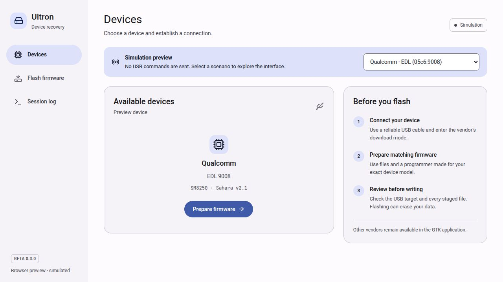

# Ultron Material 3 UI

A React frontend in a native Tauri 2 / WebKitGTK window, backed by the same
Zig Qualcomm session manager as the GTK application. This branch also fixes
backend and GTK issues. Material 3 is the primary design direction; GTK is
a temporary compatibility interface until the migration checklist is complete.
Precision Dark is retired from active development.



Browser simulation preview; the native window lists detected USB devices.

## Interface

The layout uses clean Material 3: a persistent navigation sidebar, clear device
selection, generously spaced firmware cards and ordinary confirmation dialogs.
Colors are generated from HCT seed `#5266a4` with pinned
`@material/material-color-utilities` 0.3.0. Light and dark schemes follow the
system preference. Roboto is used for controls; technical values use monospace.
Regenerate checked-in color tokens with `node ui-ts/tools/generate-tokens.mjs`.
The flat phone/recovery icon is shared by the launcher, native window and sidebar.
Its source is `src-tauri/icons/icon.svg`; regenerate its PNGs and frontend copy
with `bash src-tauri/icons/generate.sh` (requires `rsvg-convert` from librsvg).

Connect and load the Firehose programmer on Devices without selecting firmware
or XML. The programmer is uploaded to RAM; this does not flash storage. Open
Partitions & backups to read GPT tables per LUN and save raw partition images.
Flash XML is optional: inspect its image writes, erase ranges, disk patches and
automatic bootable-LUN changes, then explicitly confirm the reviewed operations.
XML content changes after review are rejected before execution. Restart requires
a running Firehose programmer; Disconnect only releases the host connection.

Firmware choices persist when switching pages and are scoped to the selected
device. Real flashing requires a review of the exact device, XML files, storage
and VIP settings. Connected sessions show their actual negotiated configuration.
Cancel waits for backend completion; closing during an operation asks first and
shuts down the daemon cooperatively. Keyboard focus, Escape and focus restoration
are handled by native HTML dialogs.

## Supported flows

- Qualcomm EDL: hotplug detection, connect, programmer upload, rawprogram/patch
  flashing, VIP, progress, logs, reset and disconnect.
- Other vendors remain available in GTK. Their TS cards explain this limitation.
- Partition browsing and backups are exposed. Partition writes/erase, UFS
  provisioning and Huawei UPDATE.APP are not exposed by the TS interface yet.
- Sparse containers are rejected on raw write paths before any payload is sent.
- Browser preview uses simulated devices and operations. It does not access USB.
- Log export saves the retained session buffer (up to 600 entries).

The shell subscribes before starting the daemon and replays device/session state
when the webview reconnects. Jobs are bound to explicit USB bus/device addresses;
device removal cancels the owned target in the daemon. Failed recovery remains a
failed operation even if the connection is restored.

## Development and verification

From the repository root:

```sh
npm --prefix ui-ts install
npm --prefix ui-ts run dev
# Browser preview: http://localhost:5173
zig build
# With the development server running:
cargo run --manifest-path src-tauri/Cargo.toml
```

For a self-contained native build:

```sh
npm --prefix ui-ts run build
zig build -Doptimize=ReleaseSafe
cargo build --release --features custom-protocol --manifest-path src-tauri/Cargo.toml
./src-tauri/target/release/ultron-ui
```

Release builds must enable `custom-protocol` to embed the frontend. The package
builder rebuilds all components and requires the daemon:

```sh
bash src-tauri/packaging/build-beta-package.sh
```

Verification:

```sh
zig build test
npm --prefix ui-ts test
npm --prefix ui-ts run build
cargo check --offline --manifest-path src-tauri/Cargo.toml
```

Requires Zig 0.16, Rust, Node 22.18+ for the TypeScript-backed regression tests,
GTK4/libadwaita, libusb, libudev and WebKitGTK 4.1 development dependencies.
The internal daemon is a GUI service, rejects arguments and has no public CLI.
`ULTRON_DAEMON_PATH` can override its location for development.

## Code map

- `src/ipc/codec.zig`: line-JSON wire contract and tests.
- `src/ipc/daemon.zig`: device scanner, request reader and manager lifecycle.
- `src-tauri/src/main.rs`: native daemon relay, job admission and shutdown.
- `ui-ts/src/state/model.ts`: state reducer; `bus.tsx`: native/simulation routing.
- `ui-ts/src/state/daemon.ts`: wire types and subscription.
- `ui-ts/src/styles/`: generated palette and component/layout styles.
- `ui-ts/src/pages/`: devices, firmware and session log.

## Troubleshooting history: the "garbled window" (solved 2026-09-26)

The beta first launched as a dark window showing blurred garbage. Two real
bugs, both fixed — and a wrong theory chased first, recorded here so nobody
re-chases it:

1. **Beta ≤ 0.3.0-3 never embedded the frontend.** Tauri only bundles
   `frontendDist` when built with its `custom-protocol` feature; a plain
   `cargo build --release` keeps the dev URL, so the installed app depended
   on a live dev server and died with "Could not connect to localhost"
   after any reboot. Fixed: `[features] custom-protocol = ["tauri/custom-protocol"]`;
   release builds MUST pass `--features custom-protocol`.
2. **Infinite re-render crash.** `BusProvider` dispatched `sourceSet` inside
   a `useMemo` keyed on state: dispatch → state change → memo re-runs →
   dispatch again — React aborted with "Too many re-renders" ~1.3 s after
   load. The crashed page left the window transparent, and the compositor's
   blur-on-translucent-windows painted the desktop backdrop scaled and
   blurred on top — which looked exactly like a GPU driver bug and sent the
   investigation chasing WebKitGTK/NVIDIA DMABUF issues (11 env workarounds,
   all irrelevant). The tell was that the same content rendered perfectly in
   a stock `MiniBrowser` and another Tauri app on the same machine. Fixed:
   commands are memoized once; the daemon subscription lives in a
   mount-once effect.

The shell still defaults `WEBKIT_DISABLE_DMABUF_RENDERER=1` (escape hatch
`ULTRON_WEBKIT_COMPAT=off`) as a precaution for the genuinely known
WebKitGTK-on-NVIDIA blank-window class — it is simply not what bit us here.

## Migration

1. Port the vendor one-shot flows (Samsung tar.md5, LG, MTK, Unisoc) from the
   GTK UI layer into daemon jobs, then light up their pages here.
2. Surface partition writes/erase, UFS provisioning and the Huawei UPDATE.APP path
   (the daemon protocol already carries them).
3. Drag-and-drop onto slots.
4. Retire GTK after feature parity and native/hardware validation.

See [the migration checklist](../docs/UI_MIGRATION.md) for the retirement gates.

Choose the Firehose programmer before connecting, then use **Connect and load programmer**.
The initial internal connect request carries the programmer, so probe and Sahara upload run
as one worker operation without waiting for a file chooser. **Probe only (advanced)** remains
available to detect an existing Firehose session; on bare EDL it leaves the handshake waiting,
and a delayed upload may require unplugging and re-entering EDL. Neither flow flashes firmware.
